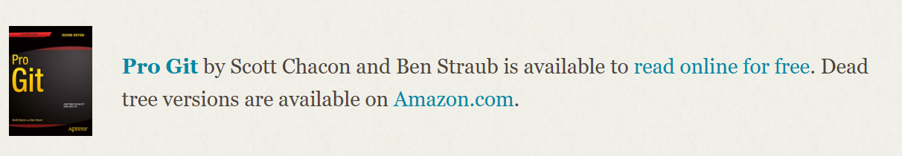

# Git Beginner Lesson

## Introduction
Welcome to the Git beginner lesson! This guide will help you understand the basics of Git and version control.

i found this new youtuber, which has great git & github videos
https://www.youtube.com/@SoloWebWiz/videos
welcome to check him out, he is very new so he will appreciate it


## Table of Contents
- [Git Beginner Lesson](#git-beginner-lesson)
  - [Introduction](#introduction)
  - [Table of Contents](#table-of-contents)
  - [What is Git?](#what-is-git)
  - [Installing Git](#installing-git)
  - [Basic Git Commands](#basic-git-commands)
  - [Creating a Repository](#creating-a-repository)
  - [Making Changes](#making-changes)
    - [1. Check the Status](#1-check-the-status)
    - [2. Add Changes](#2-add-changes)
      - [2.1 Before commititing you need to identify yourself](#21-before-commititing-you-need-to-identify-yourself)
    - [3. Commit Changes](#3-commit-changes)
    - [4. Viewing Commit History](#4-viewing-commit-history)
    - [5. Removing Files](#5-removing-files)
    - [6. Renaming Files](#6-renaming-files)
    - [7. Viewing Differences](#7-viewing-differences)
  - [Branching - live example](#branching---live-example)
  - [Merging](#merging)
  - [Conclusion](#conclusion)
  - [Github](#github)
  - [create online repository](#create-online-repository)
  - [clone that repository](#clone-that-repository)
  - [make sure you can push/pull](#make-sure-you-can-pushpull)
  - [pull request + merge](#pull-request--merge)

## What is Git?
Git is a distributed version control system that helps you track changes in your code and collaborate with others.
Created by the creator of linux, considered maybe the best programmer ever or the GOAT
Linus Torvalds, the finnish/american software engineer.

## Installing Git

to check if you have git
```sh
git --version
```

they also offer a free book!


Instructions for installing Git on different operating systems:
- **Windows**: [Download Git for Windows](https://git-scm.com/download/win)
- **macOS**: [Download Git for macOS](https://git-scm.com/download/mac)
- **Linux**: Use your package manager, e.g., `sudo apt-get install git` for Debian-based systems.

## Basic Git Commands
- `git init`: Initialize a new Git repository.
- `git status`: Show the working directory status.
- `git add`: Add files to the staging area.
- `git commit`: Commit changes to the repository.
- `git push`: Push changes to a remote repository.
- `git pull`: Pull changes from a remote repository.

## Creating a Repository
To create a new repository, navigate to your project directory and run:
```sh
git init
```

after this step, we will have a .git folder, which keep tracks of everything
the structure of this folder doesnt matter for this lesson, your
more than welcome to explore it yourselves


## Making Changes
After creating a repository, you can start making changes to your files. Here are the steps to follow:

### 1. Check the Status
Before making any changes, it's a good idea to check the status of your repository:
```sh
git status
```
This command will show you the current state of your working directory and staging area.

### 2. Add Changes
To add changes to the staging area, use the `git add` command:
```sh
git add <filename>
```
You can also add all changes at once:
```sh
git add .
```
Or add multiple files:
```sh
git add file1 file2
```

#### 2.1 Before commititing you need to identify yourself
```sh
git config --global user.email ""
git config --global user.name ""
```

### 3. Commit Changes
Once your changes are staged, you can commit them to the repository:
```sh
git commit -m "Your commit message"
```
For a more detailed commit message, you can use:
```sh
git commit
```
This will open your default text editor to write a detailed commit message.

### 4. Viewing Commit History
To view the commit history, use:
```sh
git log
```
For a more compact view, you can use:
```sh
git log --oneline
```

you have different flags to use, like --oneline, --graph, --all, --decorate --stat -p (patch) etc.


### 5. Removing Files
To remove a file from the repository and the working directory:
```sh
git rm <filename>
```
To remove a file only from the staging area:
```sh
git rm --cached <filename>
```

### 6. Renaming Files
To rename a file:
```sh
git mv <oldname> <newname>
```

### 7. Viewing Differences
To see what changes have been made to a file:
```sh
git diff <filename>
```
To see changes between commits:
```sh
git diff <commit1> <commit2>
```

## Branching - live example
first we will create a new folder.
than we will use git init to create a new repository
```sh
mkdir git-lesson
cd git-lesson
git init
```

now we will create a new basic md file 
```sh
echo "# Git Lesson" > git-lesson.md
```

now we will add this file, and commit it
```sh
git add git-lesson.md // or git add . (all new files)
git commit -m "initial commit"
```

now we will see, that if we create a new branch
it will have this commit aswell

check current branches:
```sh
git branch
```

To create a new branch:
```sh
git branch <branchname>
```
To switch to a branch:
```sh
git checkout <branchname>
```
To create and switch to a new branch:
```sh
git checkout -b <branchname>
```

you can also use git switch
```sh
git switch <branchname>
```

now we will modify the same file, and commit it
after we commit, we will switch back to the master branch
and we will see that the file is not modified
moving back to master:
```sh
git checkout master
```


## Merging
To merge a branch into your current branch:
```sh
git merge <branchname>
```

## Conclusion
Congratulations! You have learned the basics of Git. Practice these commands to become more comfortable with version control.

## Github 
Till now we only discussed local git.
so hopefully you understood that git is a local program.
So now we can understand that github is combination of git-hub
Github is help us create a online repository, and than we can utilize git,
so maintain a project between multiply programmers.
you will need to use github, in your courses like OOP, it is very recommended
and allows each one to work on seperate parts etc.
we will try to do an example:

## create online repository

We should create a github repo
its would be better, if your connected to the same
username in your IDE


## clone that repository
than we can just clone that repo into our local machine
```sh
git clone <url>
```

now we can work on that repo, and push/pull changes


## make sure you can push/pull

## pull request + merge

lets say you have a project, and you want to add a new feature
you can create a new branch, and work on that branch
after you finish, you can create a pull request
and the owner of the project can review your code
and merge it to the main branch

```sh
git checkout -b new-feature
```

after you finish your work, you can push it to the remote repo
```sh
git push
```

now you can create a pull request, and wait for the owner to review it
go into github, and create a pull request.