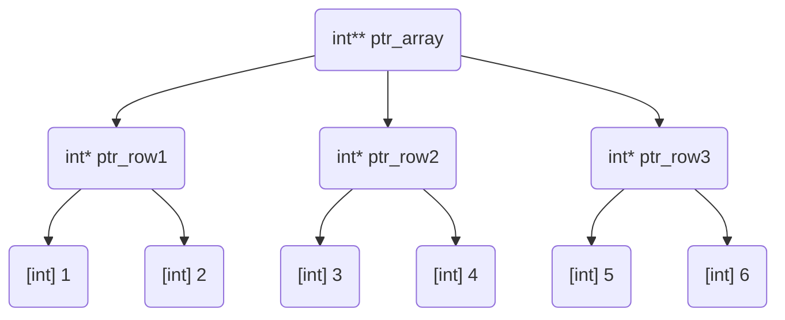
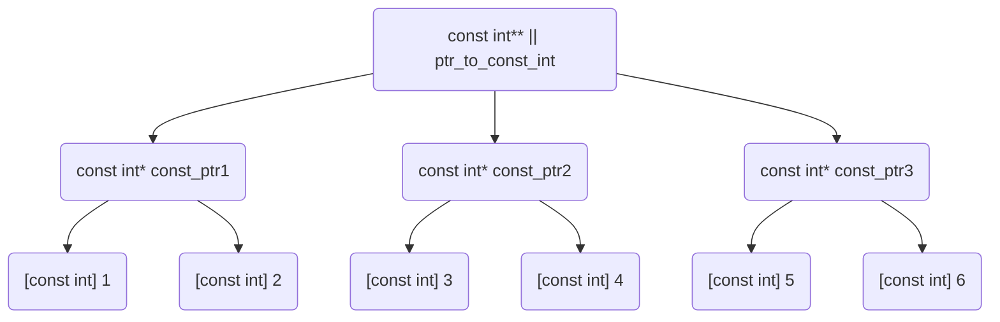
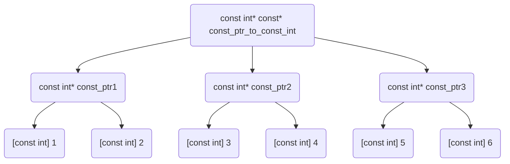

```mermaid
graph TD;
    intPtrArray("int** ptr_array") --> ptrRow1("int* ptr_row1")
    intPtrArray --> ptrRow2("int* ptr_row2")
    intPtrArray --> ptrRow3("int* ptr_row3")
    ptrRow1 --> int1("[int] 1")
    ptrRow1 --> int2("[int] 2")
    ptrRow2 --> int3("[int] 3")
    ptrRow2 --> int4("[int] 4")
    ptrRow3 --> int5("[int] 5")
    ptrRow3 --> int6("[int] 6")

```

```mermaid
graph TD;
    constIntPtrArray("const int** || ptr_to_const_int") --> constPtr1("const int* const_ptr1")
    constIntPtrArray --> constPtr2("const int* const_ptr2")
    constIntPtrArray --> constPtr3("const int* const_ptr3")
    constPtr1 --> int1("[const int] 1")
    constPtr1 --> int2("[const int] 2")
    constPtr2 --> int3("[const int] 3")
    constPtr2 --> int4("[const int] 4")
    constPtr3 --> int5("[const int] 5")
    constPtr3 --> int6("[const int] 6")

```

```mermaid
graph TD;
    constPtrToConstInt("const int* const* const_ptr_to_const_int") --> constPtr1("const int* const_ptr1")
    constPtrToConstInt --> constPtr2("const int* const_ptr2")
    constPtrToConstInt --> constPtr3("const int* const_ptr3")
    constPtr1 --> constInt1("[const int] 1")
    constPtr1 --> constInt2("[const int] 2")
    constPtr2 --> constInt3("[const int] 3")
    constPtr2 --> constInt4("[const int] 4")
    constPtr3 --> constInt5("[const int] 5")
    constPtr3 --> constInt6("[const int] 6")


```