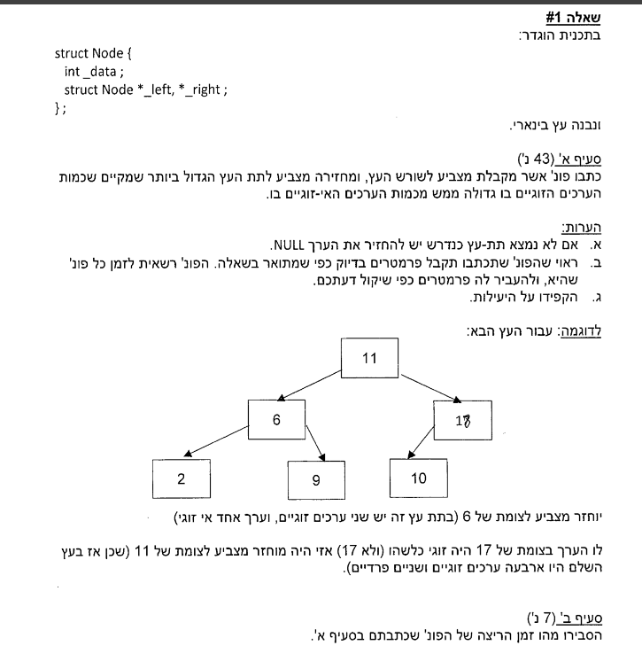

# 2017A

## Question 1



## Solution

```cpp


const struct Node* get_biggest_sub_tree(const struct Node* root)
{
    // the "outer" function

    if (root == nullptr)
    {
        return nullptr;
    }
   
   int nodes,
        diff,
        max_nodes = 0;
    const struct Node* max_sub_tree = nullptr;

    return get_biggest_sub_tree(root, nodes, diff, max_nodes, max_sub_tree);
}

const struct Node* get_biggest_sub_tree(const struct Node* root, int& nodes, int& diff, int& max_nodes, const struct Node* max_sub_tree)
{
    if (root == nullptr)
    {
        nodes = 0;
        diff = 0;
        return nullptr;
    }

    int left_nodes,
        left_diff,
        right_nodes,
        right_diff;

    const struct Node* left_sub_tree = get_biggest_sub_tree(root->_left, left_nodes, left_diff, max_nodes, max_sub_tree);
    const struct Node* right_sub_tree = get_biggest_sub_tree(root->_right, right_nodes, right_diff, max_nodes, max_sub_tree);

    nodes = left_nodes + right_nodes + 1;
    diff = left_diff + right_diff + (root->_data % 2 == 0) ? 1 : -1;

    if(diff> 0 && nodes > max_nodes)
    {
        max_nodes = nodes;
        max_sub_tree = root;
    }

    return max_sub_tree;
}
```

## Question 2

wont be on the exam, you didnt learn void*


## Question 3


## Solution
The key to notice, is they want you to use pointer to pointer.
second thing to notice, is the solution without hashmaps which you didnt learn, is o(n^2) , BUT, you can do it faster in nlogn, we first sort the array, than delete duplicates.

### the o(n^2) solution without ptr to ptr

```cpp
void removeDuplicates(Node*& head)
{
    Node* current = head;
    while(current != nullptr)
    {
        Node* temp = current;
        while(temp->next != nullptr)
        {
            if(current->data == temp->next->data)
            {
                Node* duplicate = temp->next;
                temp->next = temp->next->next;
                delete duplicate;
            }
            else
            {
                temp = temp->next;
            }
        }
        current = current->next;
    }
}
```
