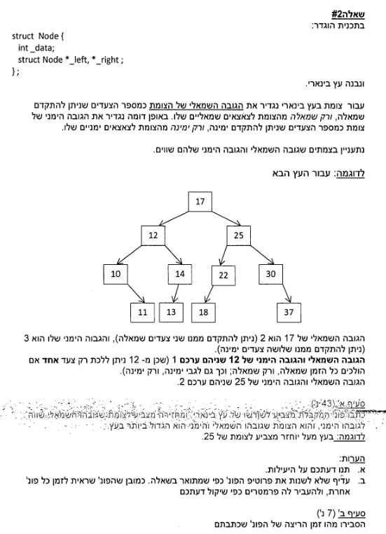

# 2017A

## Question 2



## Solution

```cpp

const Node * find_best_balanced_tree(Node* root)
{
    if (root == nullptr)
    {
        return nullptr;
    }

    int balance = -1;
    bool is_left = true;

    const Node* max_sub_tree = nullptr;

    balanced_helper(root, max_sub_tree, balance, is_left);

    return max_sub_tree;
}

int balanced_helper(const Node* root,const  Node*& max_sub_tree, int& balance, bool is_left)
{
    if (root == nullptr)
    {
        balance = 0;
        return balance;
    }

    int left_balance;
    int right_balance;

    left_balance = balanced_helper(root->_left, max_sub_tree, left_balance, true);
    right_balance = balanced_helper(root->_right, max_sub_tree, right_balance, false);

    if(left_balance == right_balance && left_balance > balance)
    {
       balance = left_balance;
       max_sub_tree = root;
    }
    if (is_left)
        return left_balance + 1;
    return right_balance + 1;
}
```

## Question 1


## Solution

```cpp

void removePrefixRows(Data &data)
{
    bool *keep = new bool[data._num_of_lines];
    init_keep(keep, data._num_of_lines);

    check_prefix(data, keep);

    int new_num_of_lines = countNewRows(data, keep);


    int **new_data = new int*[new_num_of_lines];
    int *new_lines_len = new int[new_num_of_lines];

    copy_data(data, new_data, new_lines_len, keep);
    data._num_of_lines = new_num_of_lines;
}

void copy_data(Data &data, int **new_data, int *new_lines_len, bool *keep)
{
    int new_index = 0;
    for (int i = 0; i < data._num_of_lines; ++i)
    {
        if (keep[i])
        {
            new_data[new_index] = data._data[i];
            new_lines_len[new_index] = data._lines_len[i];
            new_index++;
        }
       
    }

    delete[] data._data;
    delete[] data._lines_len;
    delete[] keep;

    data._data = new_data;
    data._lines_len = new_lines_len;
   
}

void init_keep(bool *keep, int num_of_lines)
{
    for (int i = 0; i < num_of_lines; ++i)
    {
        keep[i] = true;
    }
}

void check_prefix(const Data &data, bool *keep)
{
     for (int i = 0; i < data._num_of_lines; ++i) {
        for (int j = 0; j < data._num_of_lines; ++j) {
            if (i != j && keep[i] && keep[j] && isPrefix(data._data[i], data._lines_len[i], data._data[j], data._lines_len[j])) {
                keep[i] = false;
                break;
            }
        }
    }
}

bool isPrefix(int *line1, int len1, int *line2, int len2)
{
    if (len1 > len2)
    {
        return false;
    }
    for (int i = 0; i < len1; ++i)
    {
        if (line1[i] != line2[i])
        {
            return false;
        }
    }
    return true;
}

int countNewRows(const Data &data, bool *keep)
{
    int count = 0;
    for (int i = 0; i < data._num_of_lines; ++i)
    {
        if (keep[i])
        {
            ++count;
        }
    }
    return count;
}
```
