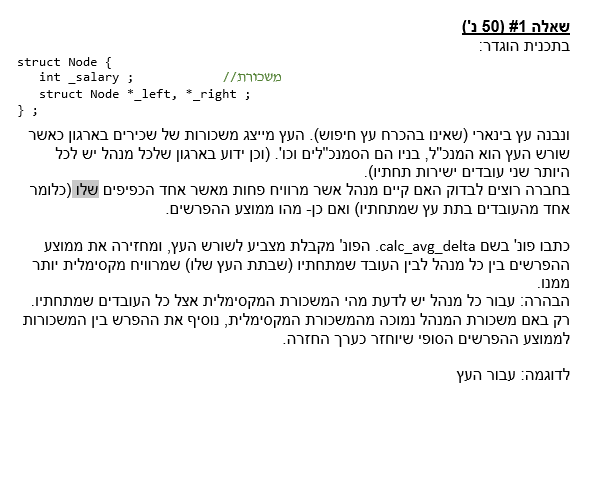
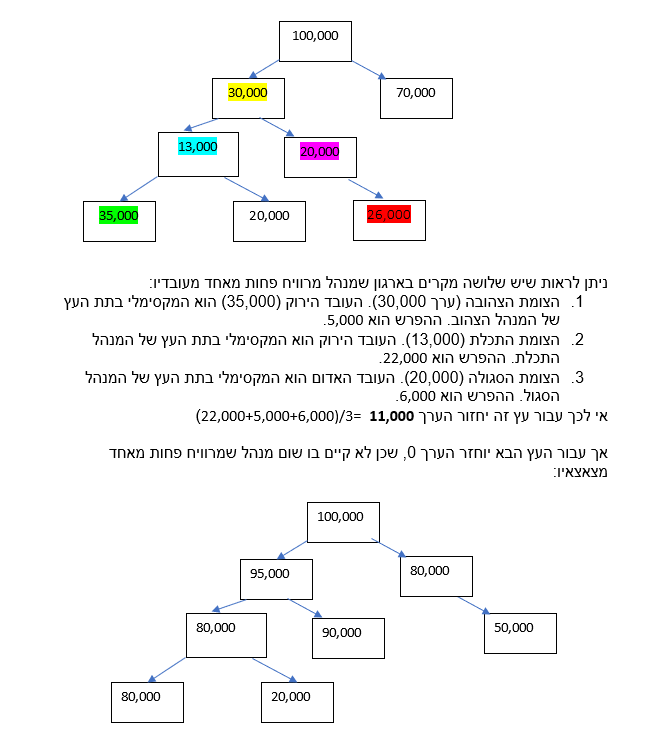
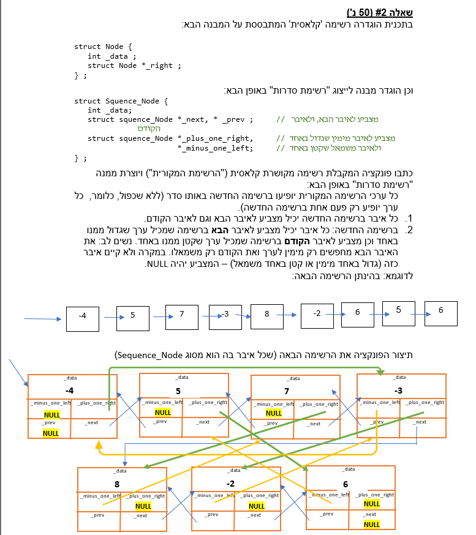
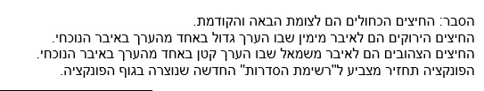

## question 1

so lets think about the first question.

we need to write a function
calc_avg_delta(Node* root)
it should return:
some double/float value, that represents the average of: a node, and the difference between the node's value and the value of its biggest child.
only if such (bigger and biggest child) exists.
so only if a child or child child etc node has bigger value than the parent.

## question 2

