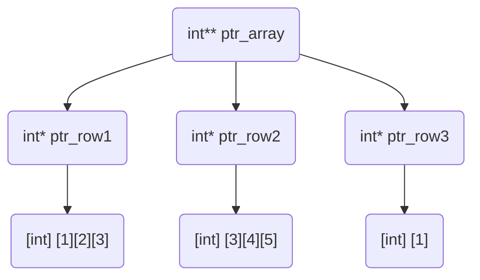
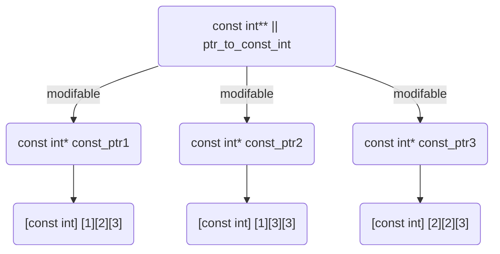
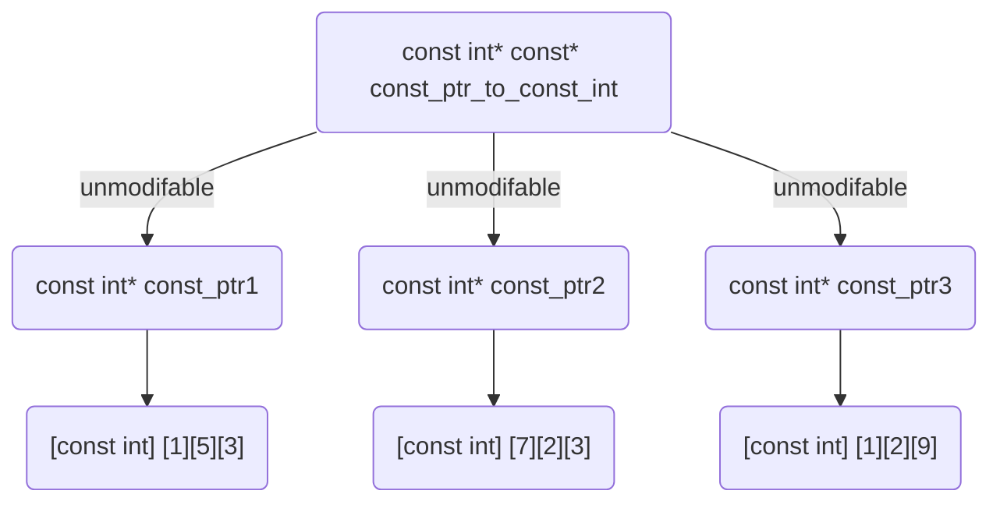

```mermaid
graph TD;
    intPtrArray("int** ptr_array") --> ptrRow1("int* ptr_row1")
    intPtrArray --> ptrRow2("int* ptr_row2")
    intPtrArray --> ptrRow3("int* ptr_row3")
    ptrRow1 --> int1("[int] [1][2][3]")
    
    ptrRow2 --> int3("[int] [3][4][5]")
  
    ptrRow3 --> int5("[int] [1]")
   

```

```mermaid
graph TD;
    constIntPtrArray("const int** || ptr_to_const_int") --modifable-->  constPtr1("const int* const_ptr1")
    constIntPtrArray --modifable--> constPtr2("const int* const_ptr2")
    constIntPtrArray --modifable-->  constPtr3("const int* const_ptr3")
    constPtr1 --> int1("[const int] [1][2][3]")
    
    constPtr2 --> int3("[const int] [1][3][3]")
  
    constPtr3 --> int5("[const int] [2][2][3]")
 

```

```mermaid
graph TD;
    constPtrToConstInt("const int* const* const_ptr_to_const_int") --unmodifable--> constPtr1("const int* const_ptr1")
    constPtrToConstInt --unmodifable--> constPtr2("const int* const_ptr2")
    constPtrToConstInt--unmodifable-->constPtr3("const int* const_ptr3")
    constPtr1 --> constInt1("[const int] [1][5][3]")
   
    constPtr2 --> constInt3("[const int] [7][2][3]")
   
    constPtr3 --> constInt5("[const int] [1][2][9]")
   


```