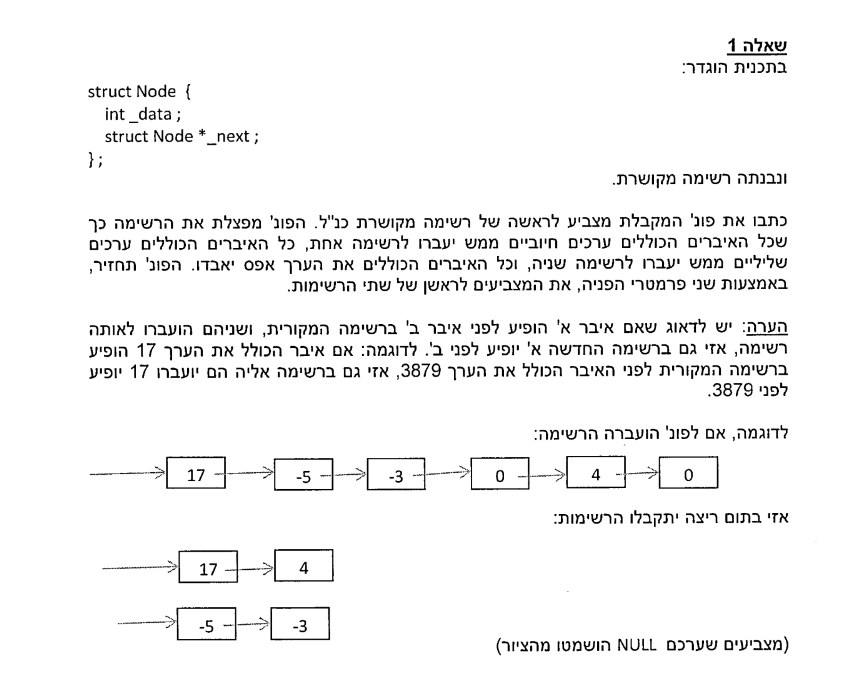

# 2015 A

## Question 1



## Solution

```cpp
void addNode(Node*& head, Node*& tail, Node* node) {
    node->_next = nullptr; // Disconnect the node from its current list
    if (head == nullptr) {
        head = node;
        tail = node;
    } else {
        tail->_next = node;
        tail = node;
    }
}

// Function to split the list into positive and negative lists
void split_list(Node*& head, Node*& head_pos_list, Node*& head_neg_list) {
    Node* current = head;
    Node* current_positive = nullptr;
    Node* current_negative = nullptr;

    while (current != nullptr) {
        Node* next = current->_next; // Save the next node
        if (current->_data > 0) {
            addNode(head_pos_list, current_positive, current);
        } else if (current->_data < 0) {
            addNode(head_neg_list, current_negative, current);
        }
        current = next;
    }

    // Clear the original list head
    head = nullptr;
}
```