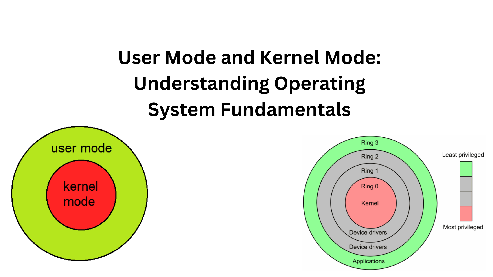

# Operating Systems: Basic Knowledge Check

## Process States
- **New**: The process is being created.
- **Ready**: The process is read to r un and waiting for the CPU.
- **Running**: Instructions are being executed.
- **Waiting(blocked)**: The process is waiting for some event to occur , like an I/O operation.
- **Terminated**: The process has finished execution.

## Address Space
- The range of memory addresses that a process can use.
- Divided into sections :
    - **Text**: Contains the program code.
    - **Data**: Contains global and static variables.
    you should remember them from the Assembly language course.
    - **Heap**: Contains dynamically allocated memory.
    - **Stack**: Contains function calls and local variables.
We have two types of address spaces:
    - **Virtual Address Space**: The range of memory addresses that a process can use, each process has its own virtual address space.
    basicly the virtual address space is the address space that the process sees, the system maps the virtual address space to the physical address space.
    the OS manages the mapping between the virtual address space and the physical address space using MMU (you wont learn about it in this course).
    - **Physical Address Space**: The actual memory addresses that are available in the system.

## Process Control Block (PCB)
- A data structure used by the operating system to store all the information about a process.
- Contains process state, process ID, program counter, CPU registers, memory management information, and I/O status information.
the pcb is essential for context switching, process scheduling, and process management for the OS.

## Kernel Mode vs User Mode

- **Kernel Mode**: The mode in which the operating system has full access to all hardware and can execute any CPU instruction.
- **User Mode**: The mode in which user applications run with restricted access to hardware and CPU instructions.
when we use System calls, are like a bridge between the user mode and the kernel mode, the user mode process requests a service from the OS, the OS switches to the kernel mode to execute the service and then returns to the user mode.
even something simple like printing to the screen is done using system calls.

## System Calls
- The mechanism used by an application to request a service from the operating system.
- Examples include file manipulation, process control, and communication.
- They are very important, they provide as a controlled interface to the kernel, and they are the only way to interact with the kernel.
which provide us hardware and system services.
some examples include (Posix/linux) : 
    - open
    - read
    - write
    - close
    - fork
    - exec
    - wait

## Interrupts
Two types of interrupts:
- **Hardware Interrupts**: Generated by hardware devices to signal that they need attention.
- **Software Interrupts**: Generated by software to signal that a system call is needed.
when we raise a singal, the CPU stops executing the current process and switches to the kernel mode to handle the interrupt, then it returns to the user mode.

## Signals
- A limited form of inter-process communication used in Unix, Linux, and other POSIX-compliant operating systems.
- Used to notify a process that a particular event has occurred.
Common signals include:
- **SIGKILL**: Terminate the process.
- **SIGINT**: Interrupt from the keyboard. (Ctrl+C)
- **SIGTERM**: Termination request.
- **SIGUSR1 & SIGUSR2**: User-defined signals.