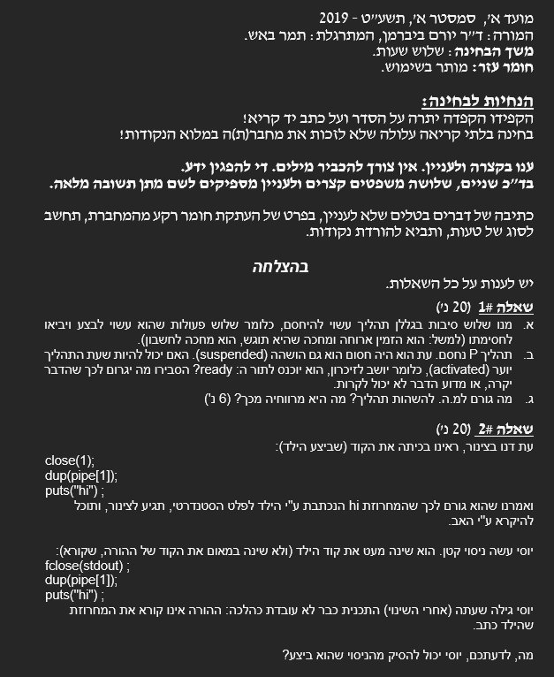
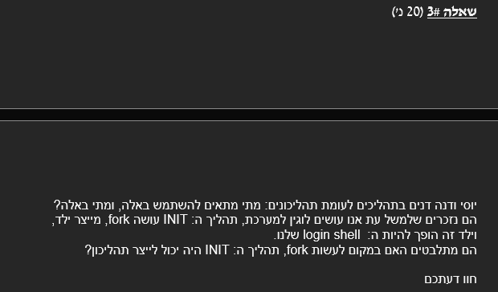
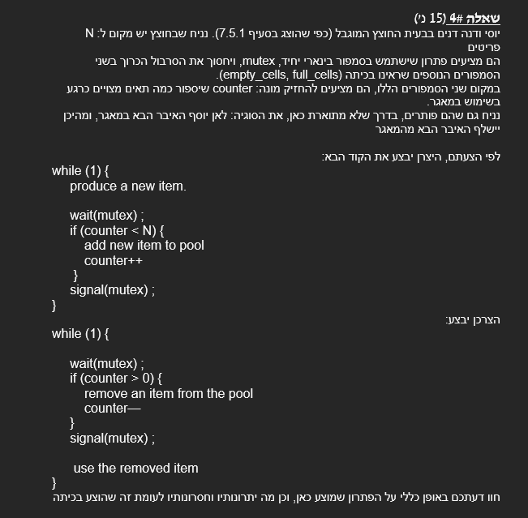
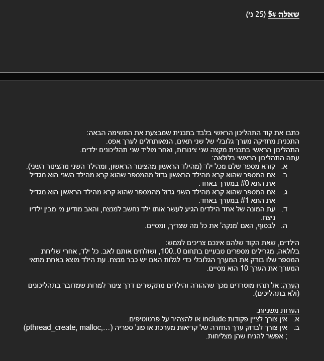

# 2019-A

## Question 1 + 2





### Answers

1.
רמז גדול כאן, הזמין ארוחה,מחכה שתוגש
פילוסופים רעבים
הוא מחכה לחשבון


2.

```c
close(1);
dup(pipe[1]);
puts("hi");
```

we change this into:

```c
fclose(stdout);
dup(pipe[1]);
puts("hi");
```

yosi has found out this is not working, whoever need to READ
The puts("hi"), will not be able to read from the pipe, using std in.

what can yosi conclude from this?


## Question 3
The init process, does fork, and that fork turns into the shell process.

Will it work if instead of fork, we will create a thread?




### Answers


## Question 4



### Answers


## Question 5



### Answers


